# Genetic Algorithms optimization using Quantum Computing simulation for NP - KnapSack Problem

In this program I will optimize the NP - KnapSack problem using genetic algorithms, but instead of setting it with bits [0 || 1], we will use Qbits, train individuals based on that and use quantum physics theory such as `Angles of rotation`, `Quantum gates`, `Superposition` and `collapse` of Qubits. The algorithm was able to optimize the problem obtaining effectiveness peaks in the first generations.

Translated with www.DeepL.com/Translator (free version)

## Pre - requeriments

1. GCC Compiler
2. input test data [`profit`, `weight`, `sumWeight`]

## KnapSack Problem

### 1. Definition 

* We will look for the best combination of objects that will give us the highest profit or ultility, without exceeding a maximum weight, if we exceed it, the backpack will break.

### 2. Genetic Algorithm

* A genetic algorithm is a search heuristic that is inspired by Charles Darwin's theory of natural evolution. This algorithm reflects the process of natural selection where the fittest individuals are selected for reproduction in order to produce offspring of the next generation.

* Charles Darwin's theory of natural evolution.

    

* The standar Loop, for improve the generations.

    

### 3. Quantum Computing

#### The Qbit 
* The Qubit is a linear combination of `[0, 1]`.  `Qubit.h`

    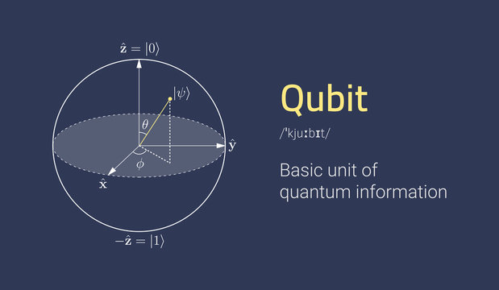
    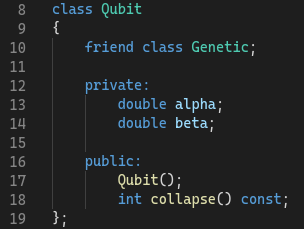

#### The Quantum Gate
* A quantum gate, quantum logic gate or quantum logic gate is a basic quantum circuit that operates on a small number of qubits, It is similar to using `OR` || `AND` || `XOR` in classical computing. :

    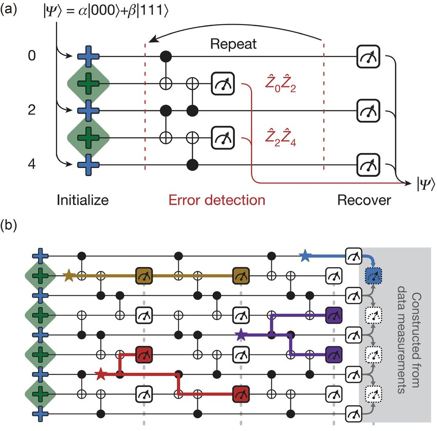
    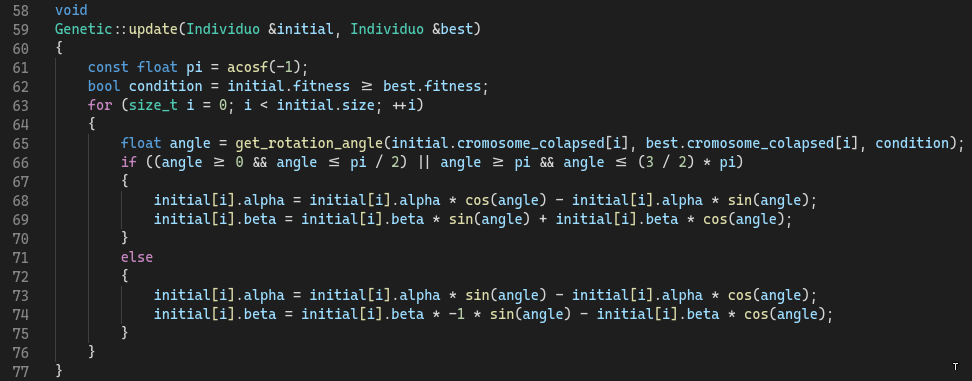

#### Rotation Angle
* When applying operations between Qubits, `alpha` and `beta` will be loaded, then the Qubits, like a sphere, will rotate and become more or less likely to be `1 or 0`.
    
    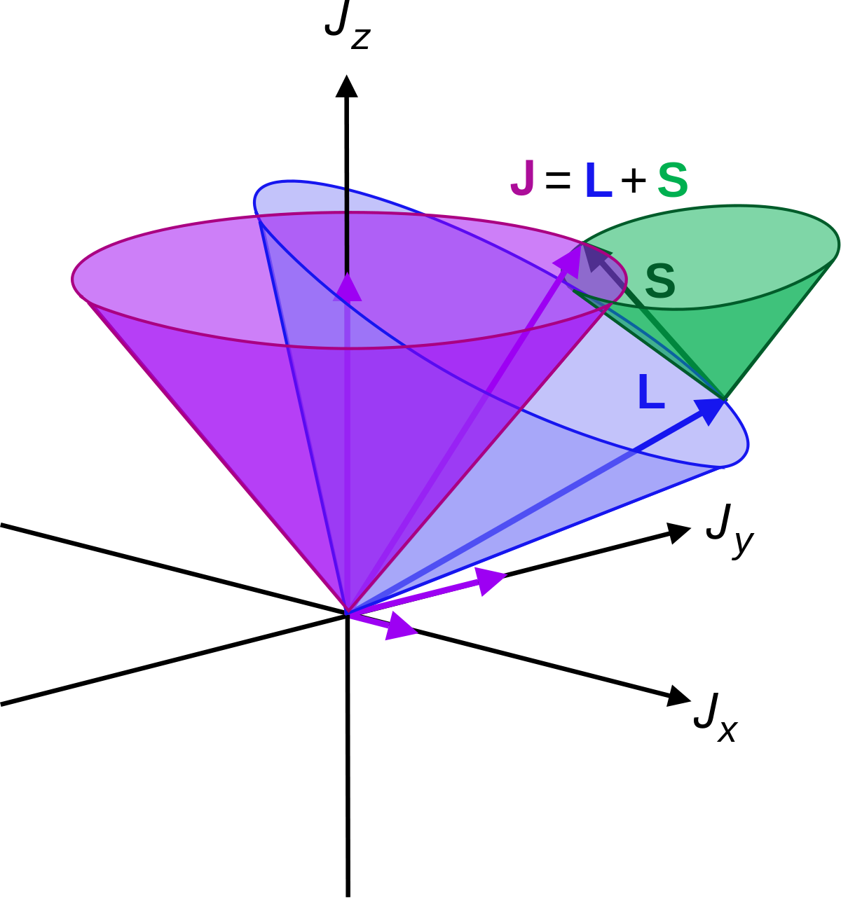
    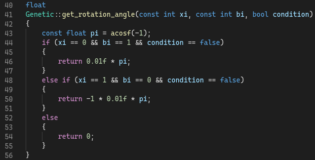

#### Quantum Cromosome
* When we translate a string of classical `bits` to `Qbits`, we must create a string of Qbits that must `change dynamically`, this will be evaluated in the algorithm, causing them to `collapse`. 

    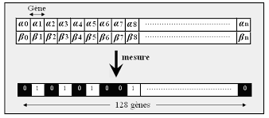
    

### 4. Genetic Algorithm

* We have a cyclical structure that will evaluate through the `generations`: 

1. Initialize `population`
2. we will use make to `collapse` the Qbit
3. We will use `repair` || `penalty`
4. We will take the best one 
5. Reproduce the best one with the whole population 
6. `Repeat`

    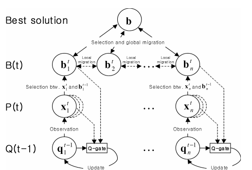
    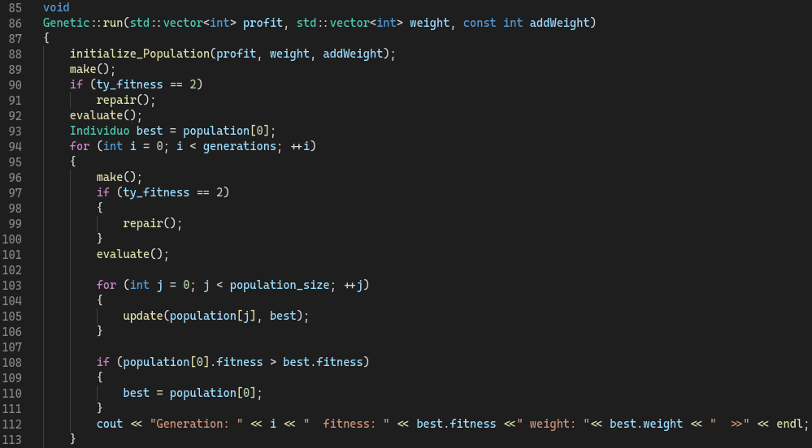

### 5. Results

* We have a comparison between the `QuantumGenetic` vs. a `GA Genetic Algorithm`. `QuantumGenetic Wins!`
    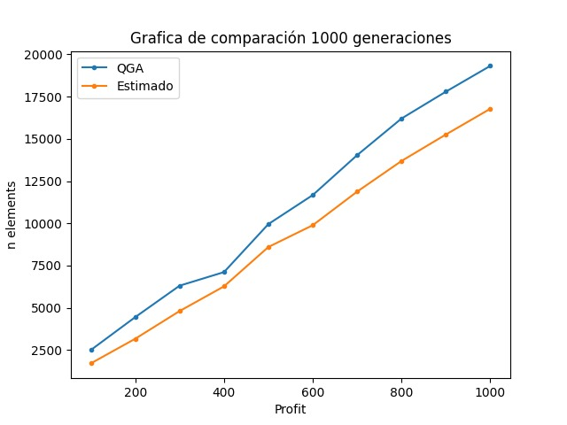

* Testing : 10 individuals
    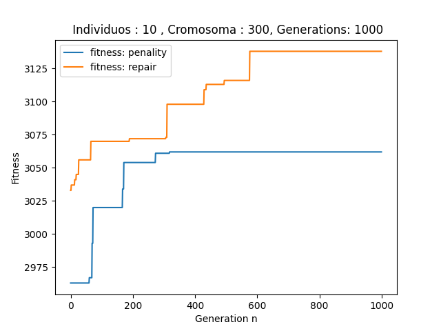

* Testing : 50 individuals
    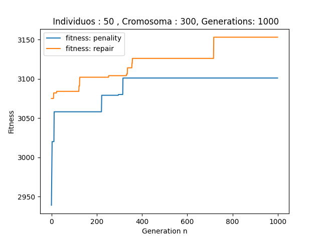

* Testing : 100 individuals
    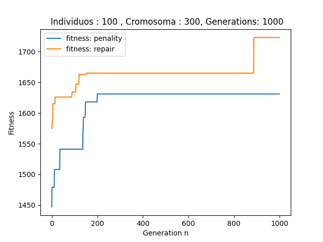

### 6. Setup

* Clone Repository `git clone https://github.com/luismoroco/KnapSack-NP-Optimizaci-n-Quantum-Computing.git`.
* Enter the directory `cd <LOCAL REPOSITORY>`.
* Excute main `g++ -o exe main.cpp`.
* Start `./exe`.

### Happy Hacking!