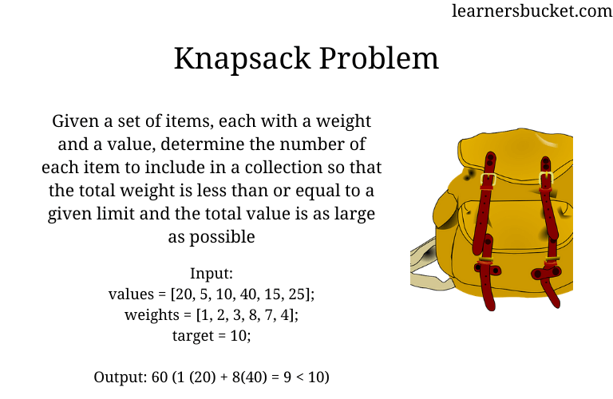
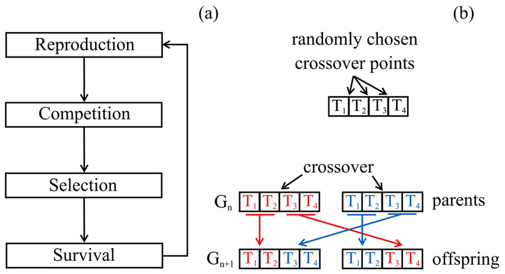

# Genetic Algorithms optimization using Quantum Computing simulation for NP - KnapSack Problem

In this program I will optimize the NP - KnapSack problem using genetic algorithms, but instead of setting it with bits [0 || 1], we will use Qbits, train individuals based on that and use quantum physics theory such as `Angles of rotation`, `Quantum gates`, `Superposition` and `collapse` of Qubits. The algorithm was able to optimize the problem obtaining effectiveness peaks in the first generations.

Translated with www.DeepL.com/Translator (free version)

## Pre - requeriments

1. GCC Compiler
2. input test data [`profit`, `weight`, `sumWeight`]

## KnapSack Problem

### 1. Definition ? 

* We will look for the best combination of objects that will give us the highest profit or ultility, without exceeding a maximum weight, if we exceed it, the backpack will break.

### 2. Genetic Algorithm

* A genetic algorithm is a search heuristic that is inspired by Charles Darwin's theory of natural evolution. This algorithm reflects the process of natural selection where the fittest individuals are selected for reproduction in order to produce offspring of the next generation.

* Charles Darwin's theory of natural evolution.

    

* The standar Loop, for improve the generations.

    

### 3. Integrate with xUnit

* Installation of Jest using NPM
    > `npm i --save-dev jest`
* Test script, file will contain four tests to two different forms `test.js`

    

* Console report of the results:

    

### 4. Setup 

* Clone Repository `git clone https://github.com/luismoroco/Selenium-Jest.git`.
* Enter the directory `cd <LOCAL REPOSITORY>`.
* Install modules `npm install`.
* Start testing `npm test`.

### Happy Hacking!